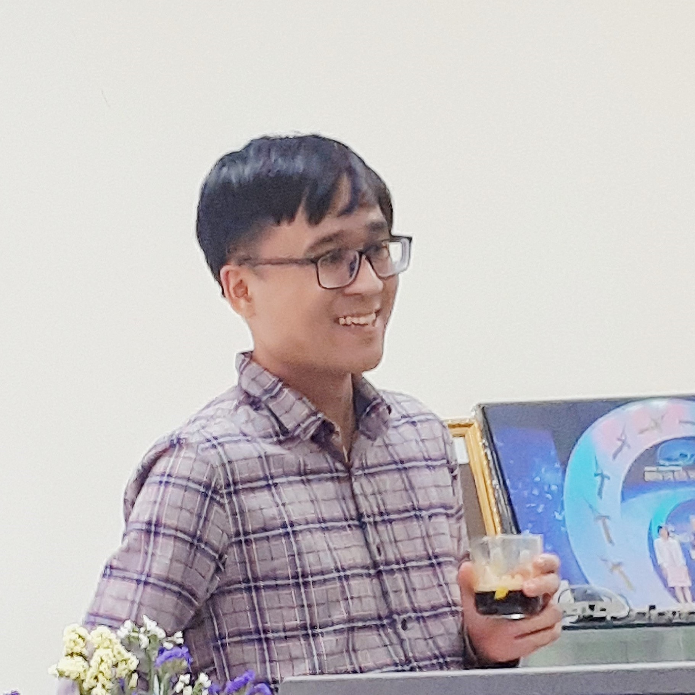

**Khanh N. Dang**  
*Assistant Professor*,  
[VNU University of Engineering and Technology (VNU-UET)](https://e.uet.vnu.edu.vn/),   
[Vietnam National University, Hanoi (VNU)](https://vnu.edu.vn/eng/)   
Room 2.1, E4, Vietnam National University, Hanoi,  
144 Xuan Thuy Rd., Hanoi,  Vietnam  [\[map\]](https://goo.gl/maps/UZQVW4WS47aPM4ue9) 
Email: [khanh.n.dang@vnu.edu.vn](mailto:khanh.n.dang@vnu.edu.vn)  
Tel.: +84-24-3754 9664 (office)  
[ORCID](https://orcid.org/0000-0001-6702-3870) | [Google Scholar](https://scholar.google.com.vn/citations?user=mQbqkUMAAAAJ) | [Researchgate](https://www.researchgate.net/profile/Khanh-Dang-16) | [dblp](https://dblp.uni-trier.de/pid/184/5348.html) | [Publons](https://publons.com/researcher/3564843) | [Linkedin](https://www.linkedin.com/in/khanhndang) | [Github](https://github.com/khanhdang)

---

## Short Bio.

Khanh N. Dang (family name: Dang (Đặng, IPA: ɗa̰ʔŋ˨˩), first name: Khanh (Khánh, IPA: xajŋ˧˥) in Vietnamese: Đặng Nam Khánh, in カタカナ: カイン ナム コイン) received his Ph.D. degree from The University of Aizu, Japan in 2017.  Since 2017, he has been an assistant professor at VNU Key Laboratory for Smart Integrated Systems, VNU University of Engineering and Technology, Vietnam National University Hanoi (VNU), Hanoi Vietnam. He was a visiting researcher at University of Aizu in 2019 and 2020-2021. Dr. Khanh has served and TPC members of several IEEE conferences and a TPC co-chair for MCSoC-2019, APCCAS-2020 and MCSoC-2021.  His research interests include [neuromorphic computing](./research), [3D Integrated Circuits technology](./research), [Artificial Intelligence  for CAD](./research), and [fault-tolerant computing](./research).

---

## Professional Experience
- *Assistant Professor*, **VNU University of Engineering and Technology, Vietnam National University, Hanoi**, 2017 - present
- *Visiting Researcher*, **The University of Aizu**, 2020 November - 2021 March
- *Visiting Researcher*, **The University of Aizu**, 2019 May - 2019 September
- *Researcher*, **SISLAB, Vietnam National University, Hanoi**, 2011-2014
- *RTL Designer*, **Dolphin Vietnam Inc.**, 2010-2011

---

## Education
- Ph.D. in *Computer Science and Engineering*, **The University of Aizu, Japan**, 2017
- M.Sc. in *Information Systems & Technology*, **University of Paris-XI, France**,  2014
- B.Sc. in *Electronics & Telecommunications*, **VNU University of Engineering and Technology, Vietnam**, 2011

---

## Research

- Neuromorphic Computing
- AI for Computer-Aided Design
- Thermal-aware 3D-ICs
- Network-on-Chips/System-on-Chips
- Fault-tolerance computing

For more details, please visit the [research page](/research).

---

## Grants & Fundings

1. *"Hotspot aware Fault-Tolerant Architectures and Algorithms for TSV-based 3D Network-on-Chips"*, main PI, funded by **National Foundation for Science and Technology Development (NAFOSTED)** under *No. 102.01-2018.312* (2019-2021)
1. *"Soft Error Resilient Architecture and Algorithm for Network-on-Chip"* : main PI, funded by **VNU University of Engineering and Technology (VNU-UET)** under project *No. CN18.10* (2018-2019)
1. *"Development of IoT Dual Band Transmitters for Agriculture (IOTA)"*, core member, funded by the **Ministry of Science and Technology (World Bank project)** (2018-2019).
1. *"Reconfiguration Solution in Designing Network-on-Chip Architectures "*, core member, funded by **National Foundation for Science and Technology Development (NAFOSTED)** under *No. 102.01-2013.17* (2014-2016).
1. *"Investigation, Design, and Implementation of a Video Encoder for Next Generation Multimedia Equipment"*, core member, funded by  **Vietnam National University, Hanoi (VNU)** under *No. QGĐA.10.02* (2010-2013).

---

## Awards

1. *Second Prize* (the 2nd best) of **Vietnamese Talents Award 2015** (Giải Nhì, Giải thưởng Nhân tài Đất Việt 2015). The Second Prize awarded to our VENGME H.264/AVC encoding chip which I took part in the design team.
2. *Best Student Paper Award* at **International Symposium on Ubiquitous Networking (UNet 2021)** for paper:
Ogbodo Mark Ikechukwu, Khanh N. Dang and Abderazek Ben. Abdallah, “Energy-efficient Spike-based Scalable Architecture for Next-generation Cognitive AI Computing Systems”. More details [\[here\]](./2021/05/22/Best_Paper_Award_Unet.html).

---

## Academic service

- Member of IEEE, IEEE CASS, IEEE SSCS
- TPC co-chair: IEEE MCSoC 2019, IEEE APCCAS 2020, IEEE MCSoC 2021
- Publication chair: MCSoC-2019
- TPC member: : IEEE MCSoC 2018, IEEE MCSoC 2019, IEEE ICCE 2020, IEEE APCCAS 2020, IEEE MCSoC 2021, IEEE APCCAS 2021
- Journal review: IEEE ACCESS, IEEE TCAS-I, ACM JETC, Elsevier MICPRO, Springer SUPE, Elsevier JSA, Frontiers in Neuroscience
- Conference review: IEEE MCSoC 2017, IEEE MCSoC 2018, IEEE MCSoC 2019, IEEE ATC 2020, IEEE APCCAS 2020, IEEE ICCE 2020, IEEE ISCAS 2021, IEEE APCCAS 2021

For more details, please visit the [service page](/service).