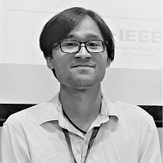

Hi, you are visiting my website and my name is **Khanh N. Dang** (family name: Dang, first name: Khanh, in Vietnamese: Đặng Nam Khánh). I am an *Assistant Professor* of VNU University of Engineering and Technology, Vietnam
National University, Hanoi (VNU), Vietnam.

My current research topics are [neuromorphic computing, 3D Integrated Circuits, and fault-tolerant computing](./research).

Feel free to explore and look around!

---

## News

- **2021-05:** Our paper titled "Energy-efficient Spike-based Scalable Architecture for Next Generation Cognitive AI Computing Systems" first authored by Mark has been award **Best Student Paper Award** at UNet'21. More detail [\[here\]](./2021/05/22/Best_Paper_Award_Unet.html).
- **2021-04:** Our paper titled "On the Design of a Fault-tolerant Scalable Three Dimensional NoC-based Digital
Neuromorphic System with On-chip Learning" is accepted for publication in the IEEE Access. Access the paper
[\[here\]](https://doi.org/10.1109/ACCESS.2021.3071089).
- **2021-03:** Our paper titled "HotCluster: A thermal-aware defect recovery method for Through-Silicon-Vias Towards
Reliable 3-D ICs systems" is accepted for publication in the IEEE Transactions on Computer-Aided Design of Integrated
Circuits and Systems. Access the paper [\[here\]](http://khanhdang.github.io/share/TCAD-2021.pdf).
{: .alert .alert-success}
View all news [\[here\]](./all_news)!

---
## Lastest publications

1. Mark Ogbodo, **Khanh N. Dang**,  Abderazek Ben Abdallah,  *"On the Design of a  Fault-tolerant Scalable Three Dimensional NoC-based  Digital Neuromorphic System with On-chip Learning"*, **IEEE Access**, IEEE, Volume 9, pp 64331 - 64345, 2021. \[[DOI](https://doi.org/10.1109/ACCESS.2021.3071089)\]/\[[PDF](https://ieeexplore.ieee.org/stamp/stamp.jsp?tp=&arnumber=9395458)\].
1. **Khanh N. Dang**, Akram Ben Ahmed, Abderazek Ben Abdallah, Xuan-Tu Tran, *"HotCluster: A thermal-aware defect recovery method for Through-Silicon-Vias Towards Reliable 3-D ICs systems"*, **IEEE Transactions on Computer-Aided Design of Integrated Circuits and Systems**, (in press). \[[DOI](https://doi.org/10.1109/TCAD.2021.3069370)\]/\[[PDF](http://khanhdang.github.io/share/TCAD-2021.pdf)\].
1. **Khanh N. Dang**, Akram Ben Ahmed, Ben Abdallah Abderrazak and Xuan-Tu Tran, *"TSV-OCT: A Scalable Online Multiple-TSV Defects Localization for Real-Time 3-D-IC Systems"*, **IEEE Transactions on Very Large Scale Integration Systems (TVLSI)**, IEEE, Volume 28, Issue 3, pp 672 - 685, 2020. \[[DOI](https://doi.org/10.1109/TVLSI.2019.2948878)\]/\[[PDF](./share/TVLSI-2019.pdf)\].
{: .alert .alert-primary}
View all publications [\[here\]](./pub)!
