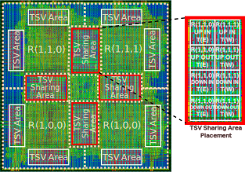

<a role="button" href="/research" class="btn btn-primary btn-sm">Back to research</a>
<a role="button" href="/research_topics/neuromorphic" class="btn btn-outline-primary btn-sm">3D Silicon Brain</a>
<a role="button" href="/research_topics/mlcad" class="btn btn-outline-primary btn-sm">Machine Learning CAD</a>
<a role="button" href="/research_topics/thermal3DICs" class="btn btn-outline-primary btn-sm">Thermal-aware 3D-ICs</a>
<a role="button" href="/research_topics/ftnoc" class="btn btn-outline-success btn-sm">Fault-tolerant Network-on-Chip</a>
<a role="button" href="/research_topics/h264" class="btn btn-outline-primary btn-sm">H.264/AVC encoder</a>

I am a member of the project as a Ph.D. student at [ASL](http://adaptive.u-aizu.ac.jp) from 2014 to 2017. 
We developed a comprehensive solution to tackle the reliability of on-chip interconnect. 
We have developed tolerance method for the permanent (hard), transient (soft), and TSV defect.

Selected publications:

1. **Khanh N. Dang**, Akram Ben Ahmed, Yuichi Okuyama, Abderazek Ben Abdallah, *"Scalable design methodology and online algorithm for TSV-cluster defects recovery in highly reliable 3D-NoC systems"*, **IEEE Transactions on Emerging Topics in Computing (TETC)**, IEEE, Volume 8, Issue 3, pp 577-590, 2020. \[[DOI](https://doi.org/10.1109/TETC.2017.2762407)\]/\[[PDF](../share/TETC-2017.pdf)\].
1. **Khanh N. Dang**, Akram Ben Ahmed, Xuan-Tu Tran, Yuichi Okuyama, Abderazek Ben Abdallah, *"A Comprehensive Reliability Assessment of Fault-Resilient Network-on-Chip Using Analytical Model"*, **IEEE Transactions on Very Large Scale Integration Systems (TVLSI)**, IEEE, Volume 25, Issue 11, pp 3099-3112, 2017. \[[DOI](https://doi.org/10.1109/TVLSI.2017.2736004)\]/\[[PDF](../share/TVLSI-2017.pdf)\].
1. **Khanh N. Dang**, Michael Meyer, Yuichi Okuyama, Abderazek Ben Abdallah, *"A Low-overhead Soft-Hard Fault Tolerant Architecture, Design and Management Scheme for Reliable High-performance Many-core 3D-NoC Systems"*, **Journal of Supercomputing (SUPE)**, Springer, Volume 73, Issue 6, pp 2705–2729, 2017. \[[DOI](https://link.springer.com/article/10.1007/s11227-016-1951-0)\]/\[[PDF](../share/SUPE-2017.pdf)\].

Patent:

1. A. Ben Abdallah, **Khanh N. Dang**, Masayuki Hisada, *"A TSV fault-tolerant router system for 3D-Networks-on-Chip"*, 特願 2017-218953,
JP2019092020A, Japan (patent pending) \[[URL](https://patents.google.com/patent/JP2019092020A/en)\].

{::nomarkdown}

{:/}

*Caption:* The layout of a layer 2x2 in OASIS project: NANDGATE 45nm, NCSU FreePDK TSV. The TSV size, pitch and Keep-out Zone are 4.06umx4:06um,
10um, and 15um, respectively. TSV area is shared between the neighboring routers for tolerating TSV defect. 

<a role="button" href="/research" class="btn btn-primary btn-sm">Back to research</a>
<a role="button" href="/research_topics/neuromorphic" class="btn btn-outline-primary btn-sm">3D Silicon Brain</a>
<a role="button" href="/research_topics/mlcad" class="btn btn-outline-primary btn-sm">Machine Learning CAD</a>
<a role="button" href="/research_topics/thermal3DICs" class="btn btn-outline-primary btn-sm">Thermal-aware 3D-ICs</a>
<a role="button" href="/research_topics/ftnoc" class="btn btn-outline-success btn-sm">Fault-tolerant Network-on-Chip</a>
<a role="button" href="/research_topics/h264" class="btn btn-outline-primary btn-sm">H.264/AVC encoder</a>