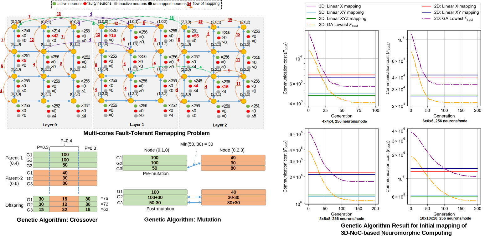

In this project, we  develop an AI framework for designing and maintaince multi/many-core system.  One of our research approach is to convert the constraints in the design phases (i.e., area, power, reliability, thermal) into a multiple-objective optimization. Here, we solve the problems using Genetic Algorithm (GA). 

{::nomarkdown}

{:/}

Selected publications:
1. Abderazek Ben Abdallah, **Khanh N. Dang**, *"Towards Robust Cognitive 3D Brain-inspired Cross-paradigm System"*, **Frontiers in Neuroscience**, Frontiers, Volume 15, pp. 795, 2021. \[[DOI: 10.3389/fnins.2021.690208](https://doi.org/10.3389/fnins.2021.690208)\]/\[[PDF](./share/pubs/FNINS-2021.pdf)\].
1. **Khanh N. Dang**, Akram Ben Ahmed, Fakhrul Zaman Rokhani, Abderazek Ben Abdallah, and Xuan-Tu Tran, *"A thermal distribution, lifetime reliability prediction and spare TSV insertion platform for stacking 3D NoCs"*, **2020 International Conference On Advanced Technologies For Communications (ATC)**, Nov. 8-10, 2020.

