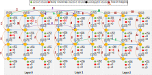

We target to develop a machine learning framework for fault recovery in parallel and distributed systems.  A faulty computing element's task can be migrated to other nodes to allow fault-tolerance computing.

{::nomarkdown}

{:/}

We have developed both Max-Flow Min-cut adaptation and Genetic Algorithm for this flow.
Selected publications:

1. **Khanh N. Dang**, Akram Ben Ahmed, Fakhrul Zaman Rokhani, Abderazek Ben Abdallah, and Xuan-Tu Tran, *"A thermal distribution, lifetime reliability prediction and spare TSV insertion platform for stacking 3D NoCs"*, **2020 International Conference On Advanced Technologies For Communications (ATC)**, Nov. 8-10, 2020.

