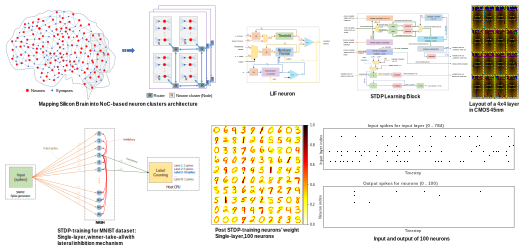

We develop hardware for neuromorphic computing that mimics the behavior of biological brains. Here, the main target is to port the silicon brains into ASIC/FPGA and train them with bio-plausible learning approaches. The hardware platform is based on Leaky-Integrate-and-Fire neuron with online STDP learning and possible off-line ANN-SNN conversion.

{::nomarkdown}

{:/}

The hardware is based on CMOS technology with 3D-ICs using Through-Silicon-Vias. Neurons are grouped into clusters that connected via a 3D Network-on-Chip. Inter-layer wires are Through-Silicon-Vias.

#### Selected publications:
1. Abderazek Ben Abdallah, **Khanh N. Dang**, *"Towards Robust Cognitive 3D Brain-inspired Cross-paradigm System"*, **Frontiers in Neuroscience**, Frontiers, Volume 15, pp. 795, 2021. \[[DOI: 10.3389/fnins.2021.690208](https://doi.org/10.3389/fnins.2021.690208)\]/\[[PDF](./share/pubs/FNINS-2021.pdf)\].
1. Ogbodo Mark Ikechukwu, **Khanh N. Dang** and Abderazek Ben. Abdallah, *"Energy-efficient Spike-based Scalable Architecture for Next-generation Cognitive AI Computing Systems"* Springer Lecture  Note in Computer Science (LNCS), **International Symposium on Ubiquitous Networking 2021 (UNET21)**, May 19 – May 22, 2021, Marakesh, Morocco. <a role="button" href="/2021/05/22/Best_Paper_Award_Unet.html" class="btn btn-outline-success btn-sm">Best Student Paper Award</a>
1. Mark Ogbodo, **Khanh N. Dang**,  Abderazek Ben Abdallah,  *"On the Design of a  Fault-tolerant Scalable Three Dimensional NoC-based  Digital Neuromorphic System with On-chip Learning"*, **IEEE Access**, IEEE, Volume 9, pp 64331 - 64345, 2021. \[[DOI](https://doi.org/10.1109/ACCESS.2021.3071089)\]/\[[PDF](https://ieeexplore.ieee.org/stamp/stamp.jsp?tp=&arnumber=9395458)\].
1. Duy-Anh Nguyen, Xuan-Tu Tran, **Khanh N. Dang**, and Francesca Iacopi,  *"A lightweight Max-Pooling method and architecture for Deep Spiking Convolutional Neural Networks"*,  **2020 IEEE Asia Pacific Conference on Circuits and Systems (APCCAS)**, Dec. 8-10, 2020.
1. Mark Ogbodo, The Vu, **Khanh N. Dang** and Abderazek Abdallah, *"Light-weight Spiking Neuron Processing Core for Large-scale 3D-NoC based Spiking Neural Network Processing Systems"*, **2020 IEEE International Conference on Big Data and Smart Computing (BigComp)**, Feb. 19-22, 2020.

#### Patent:

1. A. Ben Abdallah, Huakun Huang, **Khanh N. Dang**, Jiangning Song, *"ＡＩプロセッサ (AI Processor)"*, 特願2020-194733, Japan patent, (patent filed)
