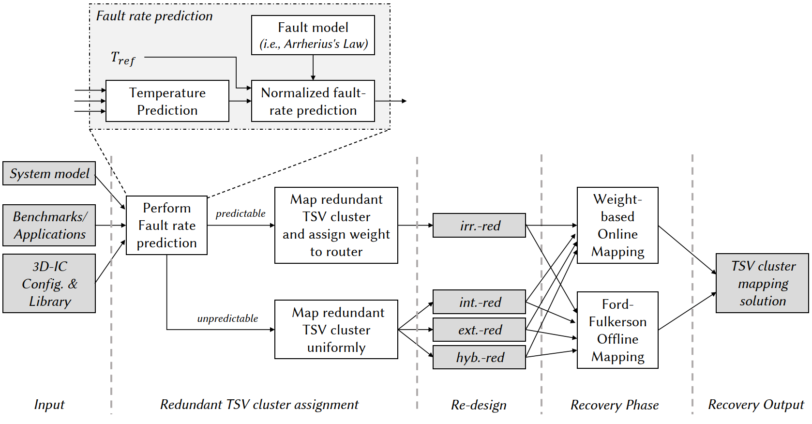

As thermal dissipation is one of the most critical challenges for stacking 3D-ICs and the Mean Time to Failure (MTTF) decreases exponentially with the operating temperature as in Black’s mode. In this research, we target to develop algorithms and architectures to solve the lifetime reliability of 3D-ICs with awareness of thermal impact.

{::nomarkdown}

{:/}
Normalized thermal acceleration for lifetime reliability of CMOS and Copper with the Black's model. The fault rates are normalized to 343.15K (70°C).
In  in 80°C, the fault rates are 2x and 3x of 70°C for CMOS and Copper, respectively.

{::nomarkdown}

{:/}
The HotCluster platform to predict the fault rate and to place spare modules. Details in [here](https://doi.org/10.1109/TCAD.2021.3069370).

Selected publications:
1. **Khanh N. Dang**, Akram Ben Ahmed, Abderazek Ben Abdallah, Xuan-Tu Tran, *"HotCluster: A thermal-aware defect recovery method for Through-Silicon-Vias Towards Reliable 3-D ICs systems"*, **IEEE Transactions on Computer-Aided Design of Integrated Circuits and Systems**, **(in press)**. \[[DOI](https://doi.org/10.1109/TCAD.2021.3069370)\]/\[[PDF](../share/TCAD-2021.pdf)\].
1. **Khanh N. Dang**, Akram Ben Ahmed, Abderazek Ben Abdallah, Xuan-Tu Tran, *"A thermal-aware on-line fault tolerance method for TSV lifetime reliability in 3D-NoC systems"*, **IEEE Access**, IEEE, Volume 8, pp 166642-166657, 2020. \[[DOI](https://doi.org/10.1109/ACCESS.2020.3022904 )\]/\[[PDF](../share/09189765.pdf)\].
1. **Khanh N. Dang**, Akram Ben Ahmed, Ben Abdallah Abderrazak and Xuan-Tu Tran, *"TSV-OCT: A Scalable Online Multiple-TSV Defects Localization for Real-Time 3-D-IC Systems"*, **IEEE Transactions on Very Large Scale Integration Systems (TVLSI)**, IEEE, Volume 28, Issue 3, pp 672 - 685, 2020. \[[DOI](https://doi.org/10.1109/TVLSI.2019.2948878)\]/\[[PDF](../share/TVLSI-2019.pdf)\].
1. **Khanh N. Dang**, Michael Meyer, Akram Ben Ahmed, Abderazek Ben Abdallah, and Xuan-Tu Tran, *"A non-blocking non-degrading multi-defect link test method for 3D-Networks-on-Chip"*, **IEEE Access**, IEEE, Volume 8, pp 59571 - 59589, 2020. \[[DOI](https://doi.org/10.1109/ACCESS.2020.2982836)\]/\[[PDF](../share/ACCESS-2020.pdf)\].

Patents:
1. A. Ben Abdallah, **Khanh N. Dang**, Masayuki Hisada, *"Distance-aware Extended Parity Product Coding for multiple faults detection for on-chip links"*,特願2020-171553, Japan patent, (patent filed)
1. A. Ben Abdallah, **Khanh N. Dang**, *"A three-dimensional system on chip in which a TSV group including a plurality of TSVs provided to connect between layers"*, 特願2020-094220, Japan patent, (patent filed)

