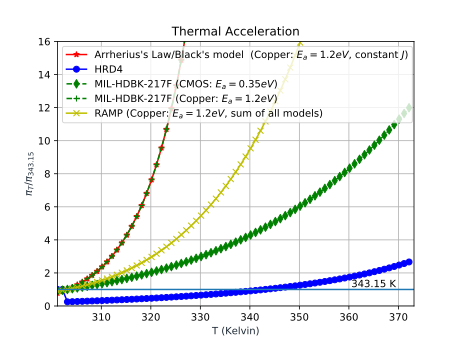

<a role="button" href="/research" class="btn btn-primary btn-sm">Back to research</a>
<a role="button" href="/research_topics/neuromorphic" class="btn btn-outline-primary btn-sm">3D Silicon Brain</a>
<a role="button" href="/research_topics/mlcad" class="btn btn-outline-primary btn-sm">Machine Learning CAD</a>
<a role="button" href="/research_topics/thermal3DICs" class="btn btn-outline-success btn-sm">Thermal-aware 3D-ICs</a>
<a role="button" href="/research_topics/ftnoc" class="btn btn-outline-primary btn-sm">Fault-tolerant Network-on-Chip</a>
<a role="button" href="/research_topics/h264" class="btn btn-outline-primary btn-sm">H.264/AVC encoder</a>

Funded by NAFOSTED under No. 102.01-2018.312 (2019-2021). I am the main PI of the project.
We target to develop algorithms and architectures to solve the on-line defect on 3D-interconnect with awareness of thermal impact.
{::nomarkdown}

{:/}
*Caption:* Normalized thermal acceleration for lifetime reliability of TSV (Cooper) with academics (RAMP, Black, and Arrherius), industry (HDR4) and military (MIL-HDBK-217F) model.
The fault rates are normalized to 343.15K (70C).

Selected publications:
1. **Khanh N. Dang**, Akram Ben Ahmed, Abderazek Ben Abdallah, Xuan-Tu Tran, *"HotCluster: A thermal-aware defect recovery method for Through-Silicon-Vias Towards Reliable 3-D ICs systems"*, **IEEE Transactions on Computer-Aided Design of Integrated Circuits and Systems**, **(in press)**. \[[DOI](https://doi.org/10.1109/TCAD.2021.3069370)\]/\[[PDF](../share/TCAD-2021.pdf)\].
1. **Khanh N. Dang**, Akram Ben Ahmed, Abderazek Ben Abdallah, Xuan-Tu Tran, *"A thermal-aware on-line fault tolerance method for TSV lifetime reliability in 3D-NoC systems"*, **IEEE Access**, IEEE, Volume 8, pp 166642-166657, 2020. \[[DOI](https://doi.org/10.1109/ACCESS.2020.3022904 )\]/\[[PDF](../share/09189765.pdf)\].
1. **Khanh N. Dang**, Akram Ben Ahmed, Ben Abdallah Abderrazak and Xuan-Tu Tran, *"TSV-OCT: A Scalable Online Multiple-TSV Defects Localization for Real-Time 3-D-IC Systems"*, **IEEE Transactions on Very Large Scale Integration Systems (TVLSI)**, IEEE, Volume 28, Issue 3, pp 672 - 685, 2020. \[[DOI](https://doi.org/10.1109/TVLSI.2019.2948878)\]/\[[PDF](../share/TVLSI-2019.pdf)\].
1. **Khanh N. Dang**, Michael Meyer, Akram Ben Ahmed, Abderazek Ben Abdallah, and Xuan-Tu Tran, *"A non-blocking non-degrading multi-defect link test method for 3D-Networks-on-Chip"*, **IEEE Access**, IEEE, Volume 8, pp 59571 - 59589, 2020. \[[DOI](https://doi.org/10.1109/ACCESS.2020.2982836)\]/\[[PDF](../share/ACCESS-2020.pdf)\].

Patents:
1. A. Ben Abdallah, **Khanh N. Dang**, Masayuki Hisada, *"Distance-aware Extended Parity Product Coding for multiple faults detection for on-chip links"*,特願2020-171553, Japan patent, (patent filed)
1. A. Ben Abdallah, **Khanh N. Dang**, *"A three-dimensional system on chip in which a TSV group including a plurality of TSVs provided to connect between layers"*, 特願2020-094220, Japan patent, (patent filed)

<a role="button" href="/research" class="btn btn-primary btn-sm">Back to research</a>
<a role="button" href="/research_topics/neuromorphic" class="btn btn-outline-primary btn-sm">3D Silicon Brain</a>
<a role="button" href="/research_topics/mlcad" class="btn btn-outline-primary btn-sm">Machine Learning CAD</a>
<a role="button" href="/research_topics/thermal3DICs" class="btn btn-outline-success btn-sm">Thermal-aware 3D-ICs</a>
<a role="button" href="/research_topics/ftnoc" class="btn btn-outline-primary btn-sm">Fault-tolerant Network-on-Chip</a>
<a role="button" href="/research_topics/h264" class="btn btn-outline-primary btn-sm">H.264/AVC encoder</a>