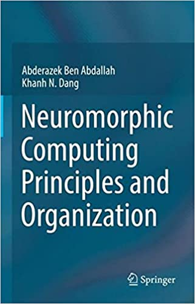

  Hi! My name is <strong>Khanh N. Dang</strong>. I am an associate professor at [The University of Aizu](https://u-aizu.ac.jp/en/), Japan. You are visiting my personal website.
 My research topics are neuromorphic computing, Artificial Intelligence for CAD, and fault-tolerant computing.  

We are currently looking for Master and PhD students ([link](http://web-ext.u-aizu.ac.jp/misc/benablab/joinus.html)). Please contact if you want to join us. 
{: .alert .alert-danger .text-wrap } 
---
# Our new book has been released in May 2022!

This book focuses on neuromorphic computing principles and organization and how to build fault-tolerant scalable hardware for large and medium scale spiking neural networks with learning capabilities. In addition, the book describes in a comprehensive way the organization and how to design a spike-based neuromorphic system to perform network of spiking neurons communication, computing, and adaptive learning for emerging AI applications. 

Abderazek Ben Abdallah and **Khanh N. Dang** (Authors), *"Neuromorphic Computing Principles and Organization”*, 1st edition, Publisher: Springer, ISBN-10‏ :‎ 3030925242, ISBN-13‏ :‎ 978-3030925246.

You can order from Springer: [link](https://link.springer.com/book/9783030925246),  Amazon: [link](https://www.amazon.com/dp/3030925242/ref=cm_sw_em_r_mt_dp_FDNTBNH4591SBQ769MZH) and  Amazon JP: [link](https://www.amazon.co.jp/dp/3030925242/ref=cm_sw_em_r_mt_dp_FDNTBNH4591SBQ769MZH)